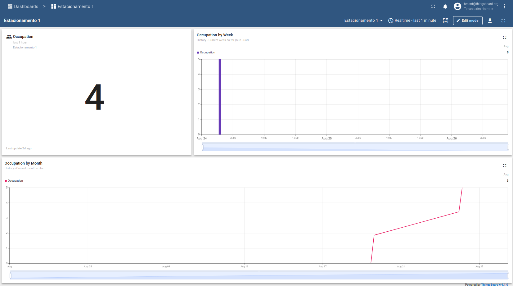

# ThingsBoard Module

This module provides the monitoring and visualization layer for the IoT Parking Management System. It uses ThingsBoard to register the parking lot device, receive occupancy data, and display real-time and historical dashboards.



> Fig. 1: ThingsBoard Dashboard, showing total occupancy and occupancy over time.

## Requirements

Make sure you have the following tools installed:

|      Tool      | Min Version |
| :------------: | :---------: |
|     Docker     |   28.0.4    |
| Docker Compose |   2.34.0    |

Before running any scripts, give execution permission:

```bash
sudo chmod +x *.sh
```

## Running

Before the first run, initialize the environment:

```bash
sudo ./init.sh
```

Then start the ThingsBoard server:

```bash
sudo ./start.sh
```

After starting, access [localhost:8080](http://localhost:8080) and log in with:

-   System Administrator: `sysadmin@thingsboard.org` / `sysadmin`
-   Tenant Administrator: `tenant@thingsboard.org` / `tenant`
-   Customer User: `customer@thingsboard.org` / `customer`

## Stopping

To stop the server:

```bash
sudo ./stop.sh
```

## Device Registration & Dashboard Setup

To receive parking data and visualize occupancy:

1. **Register a Device:**
   Create a new device in ThingsBoard representing the parking lot.
   This device will receive data from the Web Manager module.

2. **Configure Data Sources:**
   Set up the device to receive telemetry (occupancy, entry/exit events) via MQTT or HTTP integration.

3. **Build Your Dashboard:**
   Use ThingsBoard's dashboard editor to create widgets and charts showing current occupancy, historical trends, and other relevant metrics.

> Without registering a device and configuring its data sources, the dashboard will not display parking data.

## More Features

ThingsBoard offers many other features and communication methods. Feel free to explore and customize your dashboards and integrations.

---

<h6 align="center">by David Propato <a href="https://github.com/Propato">@Propato</a> & Klarine Mendonça <a href="https://github.com/Klarinemend">@Klarinemend</a></h6>
